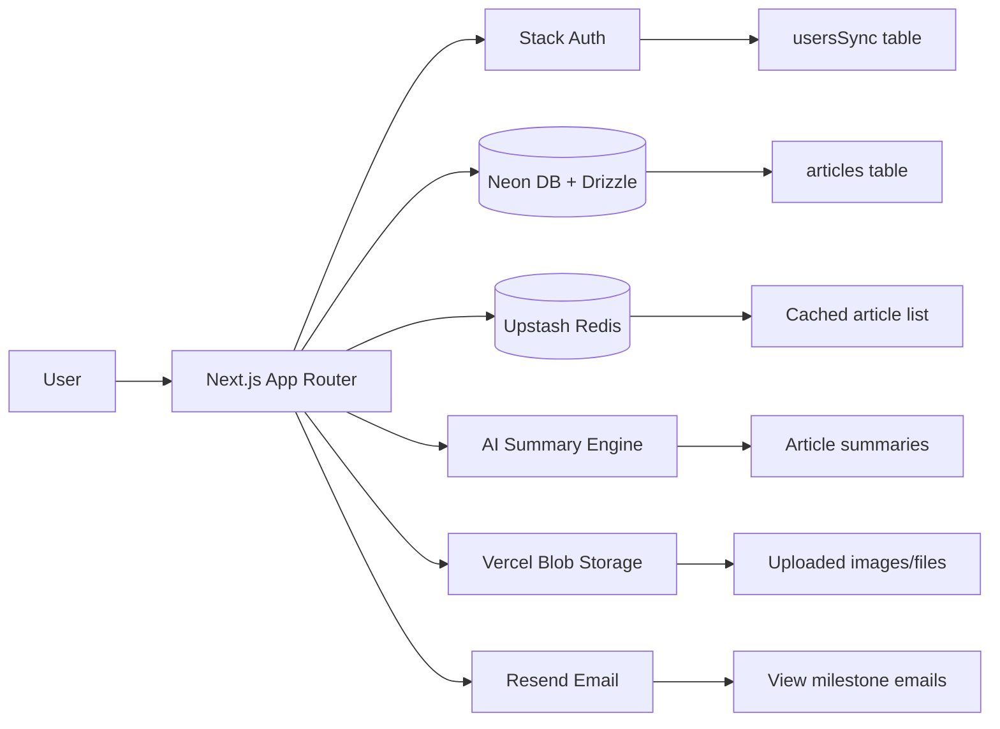

# Wikimasters

This project is a full-stack wiki application built with Next.js App Router, Neon PostgreSQL, Drizzle ORM, Stack Auth, Upstash Redis, and AI-powered article summaries. It follows the structure and learning flow of the Fullstack v4 course.

## 1. Project Overview

Wikimasters is a small wiki platform where users can:

- browse published articles
- create and edit wiki content
- upload images/files
- view AI-generated summaries
- track article pageviews
- receive celebration emails for milestone views

This README is designed as a quick reference for learning and future maintenance.

---

## 2. Core Components

### Application layer
- Next.js App Router in `src/app/`
- Pages for home, article view, edit, new article, and API routes
- Server actions for article create/update/delete and file upload

### Data layer
- Neon PostgreSQL database via `src/db/`
- Drizzle ORM schema and queries in `src/db/schema.ts` and `src/db/index.ts`
- Article data access helpers in `src/lib/data/articles.ts`

### Auth layer
- Stack Auth integration via `src/stack/`
- User sync into the local `usersSync` table for DB authorization

### Caching and performance
- Upstash Redis caching for article list queries in `src/cache/`
- Pageview counting and milestone tracking in `src/app/actions/pageviews.ts`

### AI features
- AI summary generation in `src/ai/summarize.ts`
- Summary generation is triggered during article create/update actions

### UI and user experience
- Tailwind-based UI components in `src/components/`
- Markdown editor and article viewer for content creation and display

---

## 3. Architecture Diagram



---

## 4. Third-Party Services and Libraries

| Service / Library | Purpose |
| --- | --- |
| Neon DB | PostgreSQL hosting for articles and user metadata |
| Drizzle ORM | Type-safe database schema, queries, and migrations |
| Stack Auth | Authentication and user session handling |
| Vercel | Hosting and deployment platform for Next.js |
| Vercel Blob | File/image upload storage |
| Upstash Redis | Cache for article list and pageview counters |
| Vercel AI SDK / OpenAI model | AI-generated article summaries |
| Resend | Celebration email delivery |

---

## 5. Key Project Files

- `package.json` — scripts and dependencies
- `src/app/` — routes, pages, and server actions
- `src/db/schema.ts` — database schema
- `src/db/index.ts` — Neon + Drizzle client
- `src/cache/index.ts` — Redis client
- `src/ai/summarize.ts` — summary generation logic
- `src/components/` — UI components and editor/viewer
- `drizzle/` — migration files
- `test/` — unit and Playwright end-to-end tests

---

## 6. Environment Variables

Create a local environment file before running the project.

Example variables:

```bash
DATABASE_URL=
NEXT_PUBLIC_STACK_PROJECT_ID=
NEXT_PUBLIC_STACK_PUBLISHABLE_CLIENT_KEY=
STACK_SECRET_SERVER_KEY=
UPSTASH_REDIS_REST_URL=
UPSTASH_REDIS_REST_TOKEN=
BLOB_READ_WRITE_TOKEN=
RESEND_API_KEY=
```

Tip: use `.env.local` for development and `.env.test` or the existing test example file for testing scenarios.

---

## 7. Development Workflow

### Install dependencies

```bash
npm install
```

### Run the app locally

```bash
npm run dev
```

Open http://localhost:3000

### Database migration

```bash
npm run db:migrate
```

### Seed sample data (optional)

```bash
npm run db:seed
```

### Lint

```bash
npm run lint
```

### Auto-fix lint issues

```bash
npm run lint:fix
```

### Format code

```bash
npm run format
```

### Type checking

```bash
npm run typecheck
```

---

## 8. Testing

### Unit tests

```bash
npm run test
```

### Watch mode

```bash
npm run test:watch
```

### E2E tests

```bash
npm run test:e2e
```

### Full CI-style validation

```bash
npm run test:ci
```

---

## 9. Deployment

This project is designed for deployment on Vercel.

### Deploy steps

1. Push the repository to GitHub.
2. Connect the repository in Vercel.
3. Add the required environment variables in Vercel project settings.
4. Deploy.

### Production build check

```bash
npm run build
```

### Start production server locally

```bash
npm start
```

---

## 10. Architecture Deep Dive

### A. Request flow: home page
1. The browser requests `/`.
2. `src/app/page.tsx` calls `getArticles()` from `src/lib/data/articles.ts`.
3. `getArticles()` checks Upstash Redis first.
   - If a cached list exists, it returns the cache immediately.
   - If not, it queries Neon via Drizzle and stores the result in Redis for 60 seconds.
4. The homepage renders article cards with summaries and author names.

Why this matters:
- it shows how the app combines DB + cache for performance
- the cache key `articles:all` is a simple example of server-side optimization

### B. Request flow: create article
1. The user submits a form from the editor UI.
2. The server action `createArticle()` in `src/app/actions/articles.ts` validates the user via Stack Auth.
3. If the user exists, it ensures the user is synced into `usersSync`.
4. It calls `summarizeArticle()` to generate an AI summary.
5. It inserts a row into `articles` in Neon DB.
6. It invalidates the Redis cache so the homepage reflects the new article.

Why this matters:
- this is the main “write path” in the app
- it demonstrates how UI, auth, DB, AI, and cache work together

### C. Request flow: edit and authorization
1. The user opens an article edit page.
2. The server action `updateArticle()` verifies the logged-in user.
3. `authorizeUserToEditArticle()` checks whether the article belongs to that user.
4. If allowed, the article content and summary are updated.

Why this matters:
- this is the core authorization pattern for protecting user-owned content

### D. Request flow: pageview tracking
1. A client action calls `incrementPageview(articleId)` from `src/app/actions/pageviews.ts`.
2. The function increments a Redis key such as `pageviews:article:42`.
3. If the count hits a milestone (10, 50, 100, ...), the app triggers a celebration email.

Why this matters:
- it shows how Redis is used for fast counters and event-driven side effects

### E. AI summary path
1. `summarizeArticle(title, article)` builds a prompt for the AI model.
2. If running in test mode, it returns a fake summary to keep tests stable.
3. Otherwise, it calls the AI SDK model and returns the generated summary.
4. The summary is stored in the `articles.summary` column.

Why this matters:
- this is the project’s main AI integration point
- the fallback behavior makes local development and tests more reliable

### F. Data model at a glance
- `articles`: main wiki content and metadata
- `usersSync`: Stack Auth user mapping used for ownership and email lookup

This separation keeps authentication concerns independent from article storage.

---

## 11. Notes for Learning and Maintenance

- The app uses server actions heavily, so it is useful to understand Next.js App Router patterns.
- The AI summary feature is intentionally resilient: if the model fails, article creation/update still continues.
- Redis is used as a simple cache layer for list queries and pageviews.
- The `usersSync` table is important because Stack Auth user IDs are stored separately from the main article ownership model.

---

## 12. Suggested Next Learning Steps

1. Trace the article creation flow from the page to the server action.
2. Explore how Redis caching is invalidated after article changes.
3. Study how AI summaries are generated and stored in the database.
4. Review the auth and authorization flow for editing articles.
5. Extend the project with richer moderation, search, or tags.

If you want, this README can also be expanded later with screenshots, contributor notes, and a troubleshooting section.
